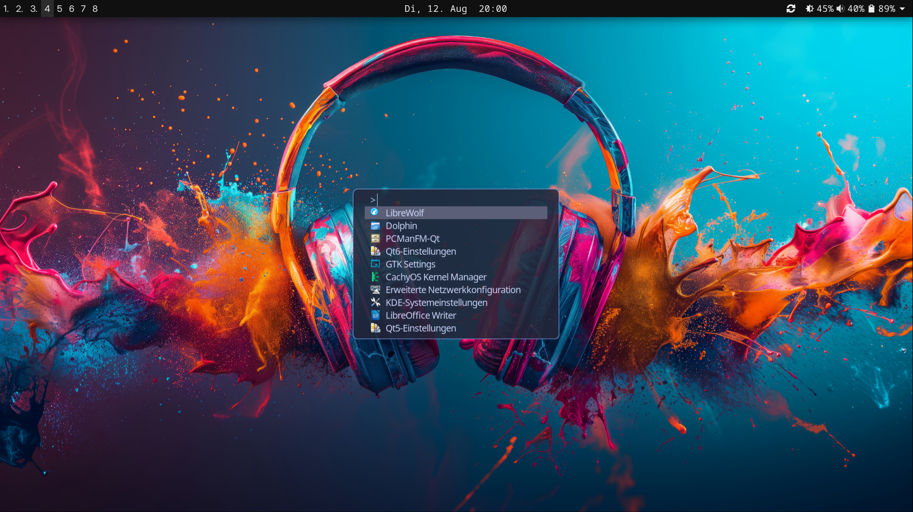

# dotfiles-sway

Just my dotfiles, with stuff stolen somewhere. Motivation was to create a near Hyprland experience. But without any AUR software.

## Software:

- Arch Linux with Swayfx (fx important for some special blur and rounded corners in the sway config)
- fuzzel
- nwg-panel
- grim
- pcmanfm-qt
- swaylock
- swayidle
- swaync
- cliphist
- alacritty
- bottom
